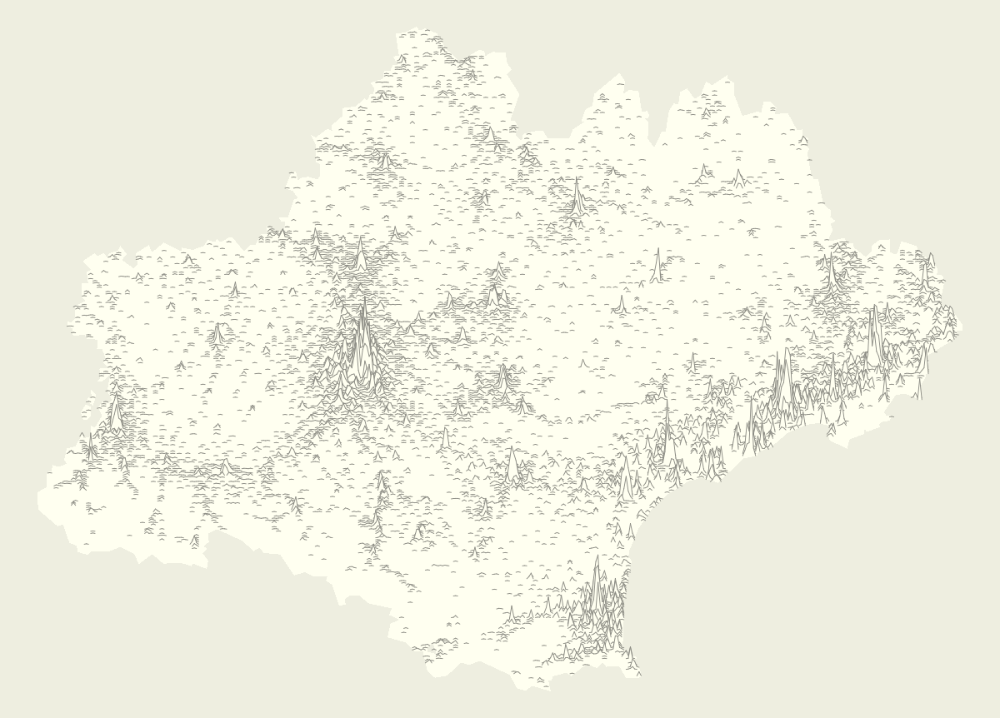

# `linemap`


## Example

```r
library(linemap)
data("Occitanie")
opar <- par(mar=c(0,0,0,0), bg = "ivory2")
if(require(sf)){
  plot(st_geometry(regOcc), col="ivory1", border = NA)
  linemap(x = popOcc, var = "pop", k = 2.5, threshold = 50,
          col = "ivory1", border = "ivory4", lwd = 0.6, add = TRUE)
}else{
  linemap(x = popOcc, var = "pop", k = 2.5, threshold = 50,
          col = "ivory1", border = "ivory4", lwd = 0.6, add = FALSE)
}
par(opar)
```



## Installation

```r
library(devtools)
install_github("rCarto/linemap")
```


## Inspiration 
[Unknown Pleasures](https://en.wikipedia.org/wiki/Unknown_Pleasures) (*Joy Division*)  
[Population Lines: How and Why I Created It](http://spatial.ly/2017/04/population-lines-how-and-why-i-created-it/) (*James Cheshire*)  
[GeospatialLineGraphs](https://github.com/Brideau/GeospatialLineGraphs) (*Ryan Brideau*)  
