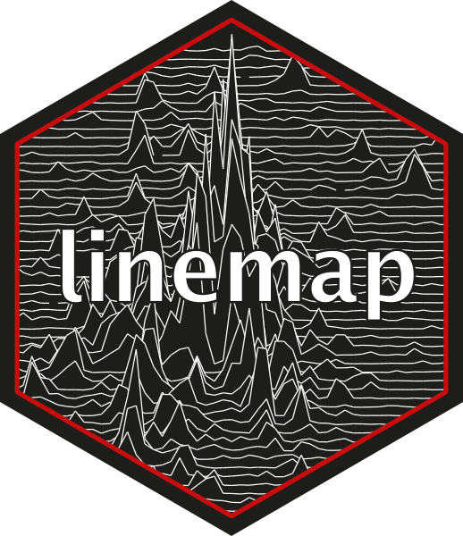
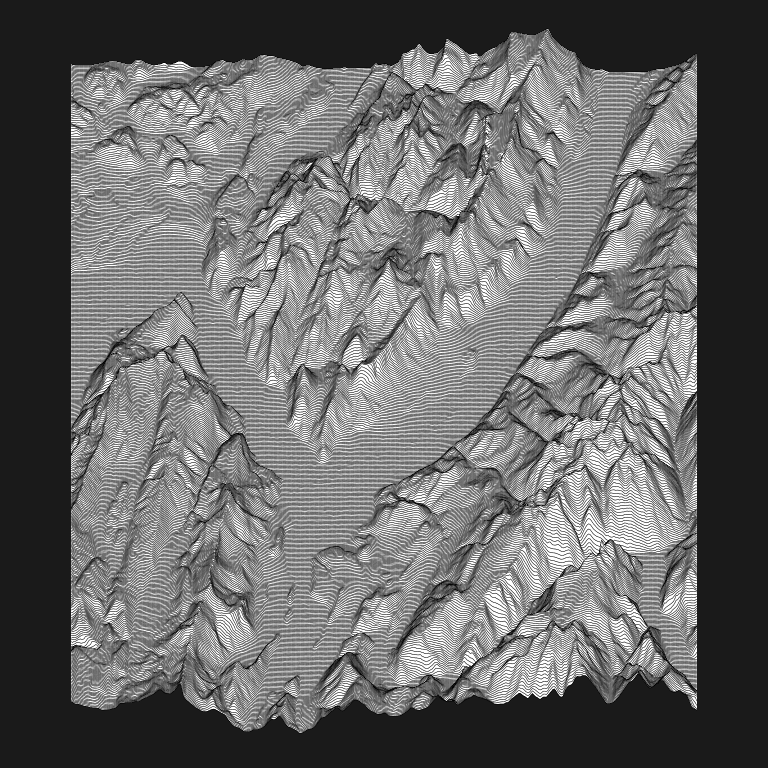

<!-- README.md is generated from README.Rmd. Please edit that file -->

# linemap: Create maps made of Lines 

[](https://github.com/riatelab/linemap/actions/workflows/R-CMD-check.yaml)
[](https://app.codecov.io/gh/riatelab/linemap?branch=master)
[](https://cran.r-project.org/package=linemap)

`linemap()` displays a map made of lines using a raster or gridded data.

## Installation

You can install `linemap` from CRAN with:

``` r
install.packages("linemap")
```

## Example

The package contains one function: `linemap()`.

``` r
library(linemap)
r <- terra::rast(system.file("tif/elevation.tif", package = "linemap"))
opar <- par(mar = c(0,0,0,0), bg = "grey10")
linemap(r)
par(opar)
```

<!-- -->

## Inspiration

[Unknown Pleasures](https://en.wikipedia.org/wiki/Unknown_Pleasures)
(*Joy Division*)  
[Population Lines: How and Why I Created
It](https://jcheshire.com/featured-maps/population-lines-how-and-why-i-created-it/)
(*James Cheshire*)  
[GeospatialLineGraphs](https://github.com/Brideau/GeospatialLineGraphs)
(*Ryan Brideau*)

## Alternative

- ggplot2 + [ggridges](https://CRAN.R-project.org/package=ggridges)
